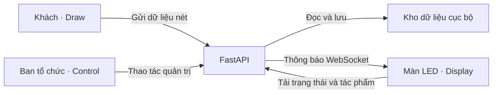

# THỜI KHẮC

*Mỗi nét vẽ – một mảnh ký ức.*
## Ba không gian chính

| Đường dẫn | Người sử dụng | Vai trò |
| --- | --- | --- |
| `/draw/` | Khách tham quan | Vẽ, chọn nét/màu và gửi tác phẩm |
| `/display/` | Máy nối màn LED | Trình chiếu 27 ô và phát Dấu Ấn |
| `/control/` | Ban tổ chức | Quản lý trang, tác phẩm, khoảnh khắc và phần kết |

Trang `/` là trang chào dành cho khách, dẫn đến Draw. Dấu Ấn không có trang độc lập: người vận hành chuẩn bị/bắt đầu/đặt lại trong Control, còn Display phát phần trình diễn.

## Kiến trúc

Một máy chủ FastAPI phục vụ giao diện, API và WebSocket. Draw gửi dữ liệu đường nét; máy chủ sinh SVG nền trong suốt và lưu trên ổ đĩa. Control và Display nhận thông báo thay đổi qua WebSocket rồi tải trạng thái và tác phẩm qua HTTP.



## Tính năng chính

- Vẽ Mono line, năm độ rộng, màu có sẵn hoặc RGB tùy chọn, tẩy, hoàn tác/làm lại và bản nháp trên thiết bị.
- Gửi có thể thử lại mà không tạo bản trùng của cùng lần gửi; chỉ làm sạch bảng sau xác nhận thành công.
- LED **1536 × 768**, tỷ lệ **2:1**, 27 ô phân bổ cân bằng, luân phiên độc lập, chuyển cảnh mờ dần và hiệu ứng ánh kim.
- Chọn trang để chỉnh không đổi màn LED; nút **Chiếu trang** mới chuyển nội dung.
- Kho nét vẽ có tìm kiếm, phân trang, yêu thích, thùng rác và xóa vĩnh viễn.
- Lưu bố cục khoảnh khắc để chiếu lại; Dấu Ấn có xem thử bằng hình mẫu và phát bằng bộ nét thật đã chốt.

## Công nghệ

- Máy chủ: Python, FastAPI/Uvicorn và Pillow.
- Giao diện: HTML, CSS và JavaScript dùng trực tiếp trong trình duyệt; không cần bước đóng gói frontend.
- Lưu trữ: JSON, SVG và file ảnh trên máy chạy ứng dụng.
- Kiểm thử: Python unittest, Node.js Test Runner và Playwright.

## Chạy nhanh

Từ thư mục dự án trên macOS hoặc Linux, với Python 3 đã cài:

```sh
python3 -m venv .venv
.venv/bin/python -m pip install -r backend/requirements.txt
.venv/bin/python run.py
```

Mở [trang chào](http://127.0.0.1:8000/), [Draw](http://127.0.0.1:8000/draw/), [Display](http://127.0.0.1:8000/display/) hoặc [Control](http://127.0.0.1:8000/control/). Mã quản trị `2468` chỉ dành cho thử nghiệm localhost.

Dừng bằng Ctrl+C. Các lần chạy sau chỉ cần `.venv/bin/python run.py`. Có thể thêm `--port 8001` để đổi cổng.

## Chạy trong mạng triển lãm

Thay mã minh họa bằng mã riêng của ban tổ chức:

```sh
CLOUD_ADMIN_PIN='thay-bang-ma-quan-tri-rieng' .venv/bin/python run.py --lan
```

LAN bắt buộc mã riêng: thiếu mã, mã trống hoặc mã mặc định `2468` sẽ bị từ chối trước khi mở máy chủ. Mở địa chỉ LAN được in khi khởi động trên các thiết bị cùng mạng; không dùng `127.0.0.1` trên điện thoại để truy cập máy điều khiển.

## Kiểm thử

Cài môi trường Python như trên và Node.js **20 trở lên**:

```sh
npm ci
npx playwright install chromium
npm test
```

Nếu đã có Google Chrome, có thể bỏ bước tải Chromium và chạy `PLAYWRIGHT_CHANNEL=chrome npm test`. Bộ test dùng kho tạm và máy chủ riêng, không tác động dữ liệu triển lãm.

CI trong [ci.yml](.github/workflows/ci.yml) chạy cùng bộ test với Chromium. Không có task lint, type checking hoặc build frontend; không coi kiểm tra cú pháp là thay thế các bước đó.

## Cấu trúc dự án

```text
run.py                Khởi động ứng dụng
backend/app/          API, xác thực, lưu trữ, phân ô và chốt Dấu Ấn
backend/storage/      Dữ liệu triển lãm, không đưa vào Git
frontend/draw/        Bảng vẽ cho khách
frontend/display/     Màn LED và nền cuộn sớ
frontend/control/     Bàn điều khiển của ban tổ chức
frontend/ending/      Module Dấu Ấn dùng chung cho Control và Display
frontend/shared/      Giao tiếp API, vật liệu nét, hình học và tài nguyên chung
tests/                Kiểm thử chức năng và trình duyệt
benchmarks/           Công cụ đo và kiểm tra thiết bị
benchmarks/results/   Báo cáo local, không đưa vào Git
docs/                 Hướng dẫn vận hành và tài liệu kỹ thuật
```

## Tài liệu

- [Vận hành triển lãm](docs/OPERATIONS.md): mạng, quản lý nội dung, sao lưu và xử lý sự cố.
- [Lắp đặt LED](docs/LED_INSTALLATION.md): kích thước, bố cục và đầu ra.
- [Dấu Ấn](docs/ENDING_CONTROL.md): chuẩn bị, phát và quay lại trình chiếu.
- [Vật liệu nét vẽ](docs/DRAW_MATERIAL.md): màu, độ rộng và đầu ra trong suốt.
- [Kiểm thử](docs/TESTING.md) và [thử Draw trên thiết bị thật](docs/DRAW_DEVICE_TESTING.md).
- [Phạm vi sản phẩm](PRODUCT.md) và [hệ thống thiết kế](DESIGN.md).

## Bảo mật và giới hạn triển khai

Ứng dụng hiện dành cho **một tiến trình máy chủ trên mạng tin cậy**. Kho dữ liệu nằm trên máy chạy ứng dụng; phiên quản trị cần đăng nhập lại sau khi máy chủ khởi động lại. Không chạy nhiều worker cùng ghi vào một kho JSON.

Mã quản trị không mã hóa đường truyền. Triển khai Internet cần HTTPS và đánh giá bảo mật riêng; test đạt không phải chứng nhận sẵn sàng vận hành công khai.

Không đưa dữ liệu khách, mã quản trị hoặc bản sao lưu lên GitHub. Giữ `backend/storage/` ngoài Git và sao lưu toàn bộ kho khi ứng dụng đã dừng. Xem [hướng dẫn vận hành](docs/OPERATIONS.md) trước khi chuyển máy hoặc xóa dữ liệu.
